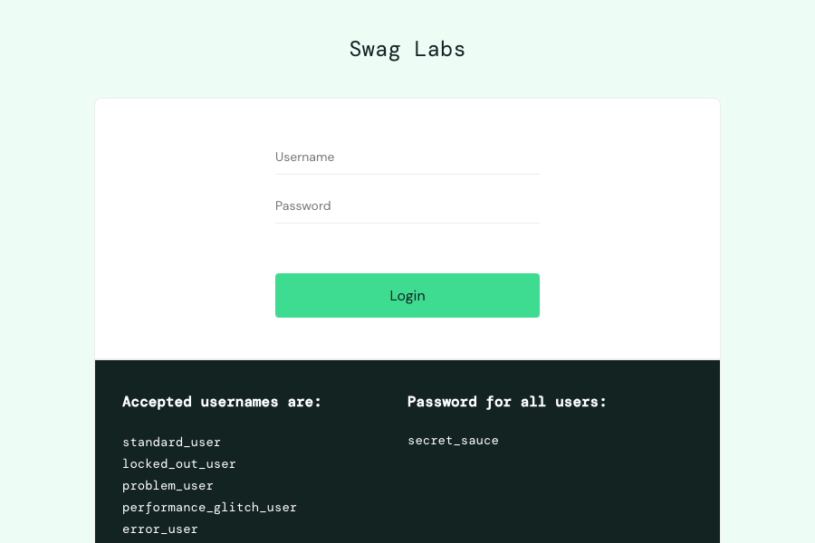
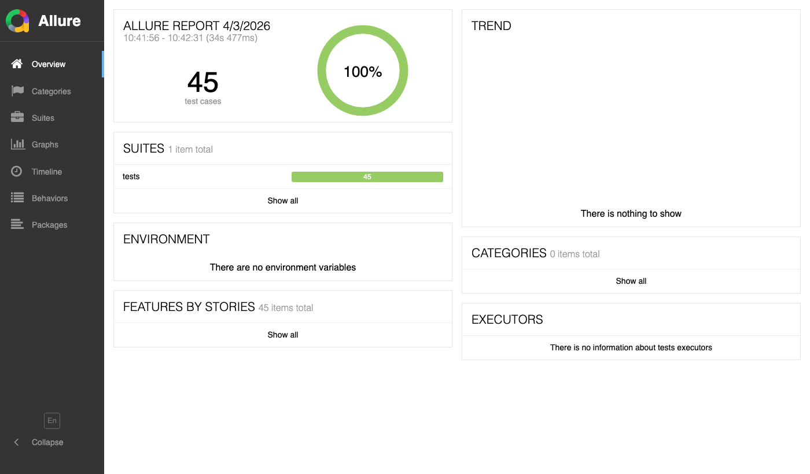

# QA Automation Framework — Playwright + Python


A production-grade QA automation framework built with **Playwright + Python**, covering UI testing, API testing, visual regression, performance testing, and CI/CD integration. Designed to reflect real-world QA engineering practices used in healthcare and SaaS environments.

---

## Test Execution



---

## Allure Report



---

## Tech Stack

| Tool | Purpose |
|---|---|
| Python 3.9 | Core language |
| Playwright 1.58 | Browser automation |
| pytest | Test runner |
| pytest-xdist | Parallel execution |
| Allure | Interactive test reporting |
| GitHub Actions | CI/CD pipeline |
| Pillow | Visual regression comparison |

---

## Project Structure

```
qa-ai-project/
├── .github/
│   └── workflows/
│       └── playwright.yml       # CI/CD pipeline
├── pages/                       # Page Object Model classes
│   ├── home_page.py
│   ├── form_page.py
│   ├── products_page.py
│   ├── login_page.py
│   ├── cart_page.py
│   ├── checkout_page.py
│   ├── performance_page.py
│   └── demoqa_page.py
├── tests/                       # All test suites
│   ├── test_home.py             # Local site tests
│   ├── test_form.py             # Form validation
│   ├── test_form_data.py        # JSON data-driven tests
│   ├── test_api.py              # REST API tests
│   ├── test_e2e.py              # End-to-end tests
│   ├── test_products.py         # Product listing & sorting
│   ├── test_visual.py           # Visual regression
│   ├── test_mock_api.py         # API mocking
│   ├── test_performance_user.py # Performance testing
│   └── test_demoqa.py           # Advanced UI interactions
├── test-data/
│   ├── form_data.json           # Test data for forms
│   └── products_data.json       # Test data for products
├── visual-baselines/            # Screenshot baselines
├── conftest.py                  # Shared fixtures
├── pytest.ini                   # Test configuration
└── index.html                   # Local test site
```

---

## Test Coverage

| Suite | Tests | Coverage |
|---|---|---|
| Local site — UI | 12 | Title, search, form validation |
| Form testing | 16 | Dropdowns, checkboxes, radio, file upload |
| Data-driven forms | 28 | JSON parametrize across 4 countries |
| REST API | 13 | GET, POST, PUT, DELETE, 404, error handling |
| End-to-end | 36 | Login → product → cart → checkout |
| Product listing | 40 | Sort, filter, cart across 3 browsers |
| Visual regression | 3 | Element-level screenshot comparison |
| Mock API | 7 | Network interception, error simulation |
| Performance | 10 | Timing comparison across user types |
| Advanced UI | 10 | Alerts, drag & drop, slider, tooltip |
| **Total** | **200+** | **3 browsers × parallel execution** |

---

## Key Features

### Cross-Browser Testing
Tests run simultaneously on Chromium, Firefox, and WebKit with a single command:
```bash
pytest tests/ -v
```

### Parallel Execution
Using `pytest-xdist` with `-n auto` — 4× faster than sequential execution:
```
Sequential: ~120s → Parallel: ~35s
```

### Page Object Model
All locators and actions are separated from test logic:
```python
class LoginPage:
    def login(self, username: str, password: str):
        self.username.fill(username)
        self.password.fill(password)
        self.login_button.click()
```

### Data-Driven Testing
Test cases driven by JSON — add new cases without changing code:
```json
{
  "valid_submissions": [
    {"country": "us", "gender": "male", "expected": "Submitted: us | agreed | male"}
  ]
}
```

### API Testing
Full CRUD coverage with real and mocked responses:
```python
def test_create_post(api: APIRequestContext):
    response = api.post("/posts", data={"title": "QA Post", "userId": 1})
    assert response.status == 201
```

### Performance Testing
Automated timing comparison across user types:
```
Standard user login:           0.99s
Performance glitch user login: 5.71s  (5.7× slower — documented bug)
```

### Visual Regression
Element-level screenshot comparison with RGB normalization:
```python
compare_screenshot_element(header, "inventory-header")
```

### Mock API Responses
Network interception to simulate server errors and edge cases:
```python
page.route("**/api/**", lambda route: route.fulfill(status=500))
```

---

## CI/CD Pipeline


Every push to `main` triggers:
1. Ubuntu server provisioned
2. Python 3.11 installed
3. Playwright + all browsers installed
4. Local test server started
5. All tests run in parallel on Chromium
6. Allure results uploaded as artifacts
7. Screenshots uploaded on failure

```yaml
- name: Run tests
  run: pytest tests/ -q -n auto --browser chromium --alluredir=allure-results
```

---

## Running Locally

```bash
# Clone the repo
git clone https://github.com/aabbasahd92/qa-ai-project.git
cd qa-ai-project

# Create virtual environment
python -m venv venv
source venv/bin/activate

# Install dependencies
pip install pytest-playwright pytest-xdist allure-pytest Pillow pytest-html

# Install browsers
playwright install

# Start local server (separate terminal)
python -m http.server 8000

# Run all tests
pytest tests/ -v

# Run specific suite
pytest tests/test_e2e.py -v --headed

# Generate Allure report
pytest tests/ --alluredir=allure-results
allure serve allure-results
```

---

## Websites Tested

| Site | Type | Tests |
|---|---|---|
| Local HTML site | Custom | Form, search, validation |
| [SauceDemo](https://www.saucedemo.com) | E-commerce demo | Login, products, cart, checkout |
| [JSONPlaceholder](https://jsonplaceholder.typicode.com) | REST API | CRUD operations |
| [DemoQA](https://demoqa.com) | QA practice site | Alerts, drag & drop, widgets |

---

## Healthcare QA Relevance

This framework reflects QA practices directly applicable to healthcare software environments:

- **Regression testing** — automated suite catches breaking changes before release
- **Cross-browser coverage** — ensures accessibility across patient-facing portals
- **API validation** — verifies data integrity across service boundaries
- **CI/CD integration** — supports continuous delivery in regulated environments
- **Evidence capture** — screenshots and video on failure support audit trails
- **Performance benchmarking** — identifies SLA violations before they reach patients

---

## About

Built by **Ahmed Abbas** — Senior QA Engineer with 7+ years of experience in healthcare QA (CVS Health, Aetna), specializing in AI-augmented QA automation engineering.

[](https://www.linkedin.com/in/ahamed-abbas-49421856/)
[](https://github.com/aabbasahd92)
